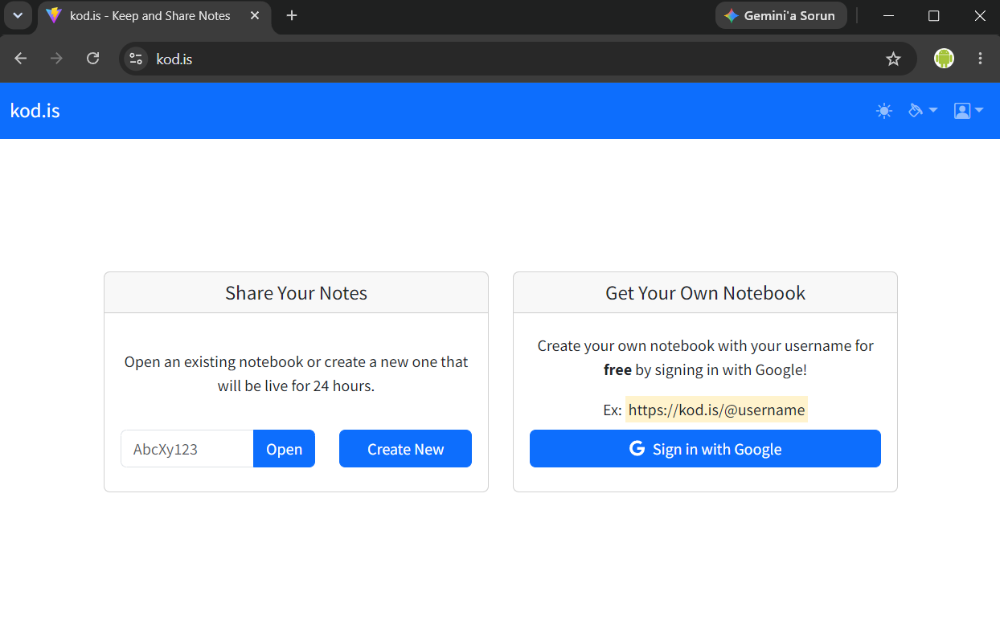

# kod.is

**Live app: [https://kod.is](https://kod.is)**

kod.is is a browser-based notepad for writing something down and sharing it over a short link. Anyone can open the site, type notes into a tabbed editor and get a link like `kod.is/a3Bq7D` that stays alive for 24 hours — no account, no setup. Signing in with Google lets you claim a username and keep a permanent notebook at `kod.is/@username` instead. This repository holds the React frontend; the API lives in a separate repository (see [Architecture](#architecture)).



## Features

- **Anonymous notebooks** — create a notebook without signing in. The API returns a short slug (`kod.is/a3Bq7D`) and the notebook is deleted after 24 hours.
- **Google sign-in** — OAuth via the Google Identity Services SDK, offered both as a sign-in button and as a One Tap prompt.
- **Permanent user notebooks** — a signed-in user picks a username (5–20 characters, letter first) and gets a notebook that does not expire at `kod.is/@username`.
- **Short link sharing** — the navbar shows the current notebook's URL with a one-click copy button.
- **Tabbed multi-note editor** — a notebook holds several notes as tabs. Add a tab, delete one, or click the active tab to rename it.
- **Differential saving** — on save the editor compares the current notes against the last known server state and sends only new, changed and deleted notes rather than the whole notebook.
- **JWT session with silent refresh** — access and refresh tokens are kept in `localStorage`, and an axios interceptor transparently refreshes an expired access token and replays the failed request. Concurrent 401s share a single refresh call, because the API rotates refresh tokens and treats a replayed one as token theft.
- **Resume where you left off** — the last opened notebook code is remembered locally, so returning to the start screen goes straight back to that notebook (and is cleared if the notebook has expired).
- **Light / dark mode** — toggled from the navbar and persisted, applied through Bootstrap 5's `data-bs-theme`.
- **22 Bootswatch themes** — a theme picker swaps the Bootstrap stylesheet at runtime by preloading the new CDN stylesheet and dropping the old one once it is ready, avoiding an unstyled flash.
- **Readable API errors** — RFC 7807 problem details, ASP.NET model validation errors and rate-limit responses (HTTP 429, including `Retry-After`) are turned into user-facing messages.

## Tech stack

| | |
|---|---|
| Framework | React 18.2 (JavaScript + JSX, no TypeScript) |
| Build tool | Vite 4.4 with `@vitejs/plugin-react` 4.0 |
| Routing | React Router 6.16 (`createBrowserRouter` with data loaders) |
| HTTP client | axios 1.5 (request/response interceptors for auth and refresh) |
| Auth | `@react-oauth/google` 0.11, `jwt-decode` 3.1 |
| UI components | React Bootstrap 2.9 on Bootstrap 5.3.2 (loaded from CDN, with Bootswatch 5.3.2 themes) |
| Icons | Font Awesome 6.4 (`@fortawesome/react-fontawesome`), Bootstrap Icons 1.11 |
| Dialogs | SweetAlert2 11.7 with `sweetalert2-react-content` |
| Linting | ESLint 8 with the React, React Hooks and React Refresh plugins |

Bootstrap and Bootswatch CSS are loaded from a CDN at runtime rather than bundled, so that the theme picker can swap the entire stylesheet without a rebuild.

## Architecture

The project is split across two repositories:

| | |
|---|---|
| **Frontend** (this repo) | React SPA, deployed at [kod.is](https://kod.is) |
| **Backend** | ASP.NET Core Web API — [github.com/yigith/kodisapp](https://github.com/yigith/kodisapp), deployed at `kodisapi.kod.is` |

The frontend is a pure client: it holds no server-side logic and talks to the API over JSON. The API owns notebook storage, slug generation, the 24-hour expiry of anonymous notebooks, username uniqueness, Google token verification and JWT issuance.

Authentication works as follows. The Google SDK returns a credential (One Tap) or an access token (button flow) to the browser, which is posted to the API; the API verifies it with Google and responds with its own access token / refresh token pair. The access token is a JWT carrying the user's name, picture and username, which the frontend decodes to render the account menu — it is never trusted for authorization, only for display. Every subsequent request carries `Authorization: Bearer <access token>`; on a 401 the axios interceptor exchanges the refresh token for a new pair and retries once, and if that fails the session is cleared.

API endpoints consumed:

```
GET  /Notebook/{slugOrUsername}
POST /Notebook/Create
POST /Notebook/Update/{slug}
POST /Account/GoogleSignInByTokenResponse
POST /Account/GoogleSignInByGoogleOneTap
POST /Account/RefreshLogin
POST /Account/SetUsername
POST /Account/Check
POST /Account/Logout
```

## Getting started

### Prerequisites

- Node.js 18 or newer
- A running kod.is API — either the deployed one, or a local instance of [kodisapp](https://github.com/yigith/kodisapp)

### Setup

```bash
git clone https://github.com/yigith/kodis.git
cd kodis
npm install
```

### Environment variables

Copy `.env.example` to `.env` and fill it in:

```bash
cp .env.example .env
```

| Variable | Description |
|---|---|
| `VITE_API_BASE_URL` | Base URL of the kod.is Web API, including the `/api` suffix. Every request in `src/api.js` is made relative to it. Use the deployed API (`https://kodisapi.kod.is/api`) or a locally running one. |

Vite only exposes variables prefixed with `VITE_` to the client, and everything exposed that way is embedded into the JavaScript bundle — never put a secret in one. Vite loads `.env` for every mode and `.env.development` on top of it for `npm run dev`, so a local API URL belongs in the latter. For personal overrides that should not be committed, use `.env.local` or `.env.development.local`, both of which are git-ignored.

### Run

```bash
npm run dev      # start the dev server (default: http://localhost:5173)
npm run build    # production build into dist/
npm run preview  # serve the production build locally
npm run lint     # run ESLint
```

## Project structure

```
public/            Static assets served as-is
  global.js        Loads/swaps the Bootstrap or Bootswatch stylesheet from the CDN
  default.css      Base styles applied before Bootstrap arrives
src/
  main.jsx         Entry point; applies the stored color mode before first paint
  App.jsx          Router definition and the auth / app context providers
  Layout.jsx       Navbar shell rendered around every route
  api.js           axios instance, token storage, refresh logic, error formatting
  AuthContext.jsx  Signed-in user and token state
  AppContext.jsx   Hands an already-fetched notebook to the route loader, avoiding a refetch after create/open
  pages/           Route-level components, each exporting its own React Router loader
    StartScreen/   Open-by-code, create-new, Google sign-in, username claim
    Notebook/      Tabbed note editor with create/update
    NotFound/      404 page
    ErrorPage/     Router error boundary
  components/      Reusable UI: navbar brand, link copier, account menu,
                   theme picker, color mode toggle, Google sign-in, loading states
```

## Notes

- The Google OAuth client ID is a public identifier and is currently hard-coded in `src/App.jsx`.
- `bootstrap`, `localforage`, `match-sorter` and `sort-by` are still listed in `devDependencies` but are not imported by the application; Bootstrap's CSS comes from the CDN, and the other three are leftovers from the project template.
